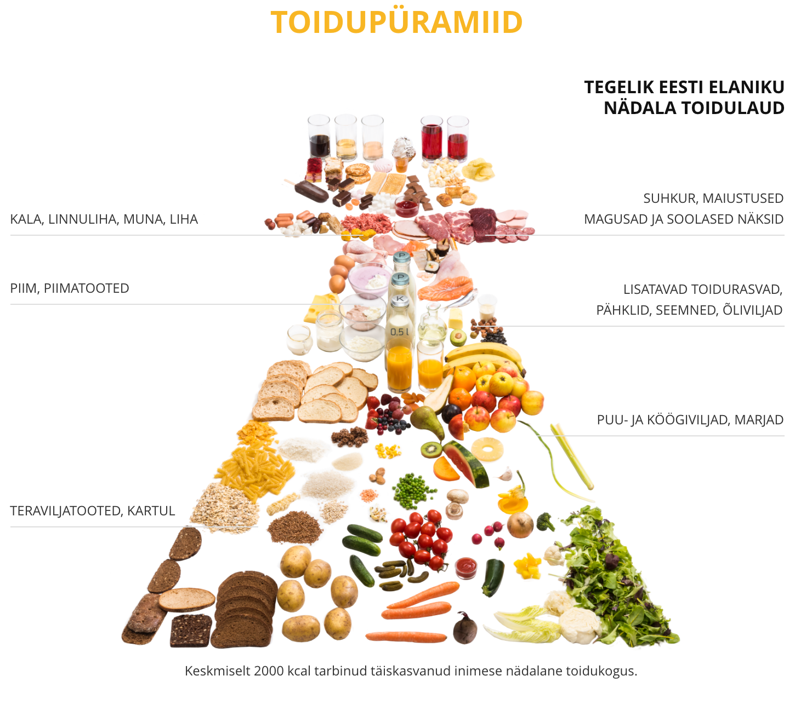

# Tervislik toitumine: Milline näeb välja tervislik toitumine? Kuidas see aitab kaasa tervise ja heaolu tõusule?

Inimene vajab piisavalt energiat ja mitmekülgsete toitainete tarbimist, et toetada oma elutegevust. Ebapiisav ja ühekülgne toitumine võib avaldada organismile mitmeid negatiivseid mõjusid ning suurendada terviseriski.

Üks tasakaalustamata toitumise tagajärgi on kaaluprobleemide teke. Kui organism ei saa vajalikke toitaineid piisavalt, võib see viia liigse söömisele, kuna organism üritab kompenseerida puuduvate toitainete puudust.

Õige toitumine on väga tähtis. Oluline on süüa mitme-külgselt, et oleksid terve. 
Teie ees on kaks toidupüramiidi, mis katab toiduvalikumenüü nädala peale. Vaadake neid ning proovige võrrelda nende erinevust.

See, mis väljendab tegelikku toidulauda, ei paistagi üleliia halb, kuna kõikidest toidu kategooria valikutest on ju kaetud igaüks. Lisaks kaloraaži kogus asub samuti normi piires.

Ükski toit pole tervislik ega ebatervislik, kasulik või kahjulik. Kõik sõltub kogustest ja söömise sagedusest. Süüa võib kõike, kuid seda tuleb teha õigetes kogustes!

Seda meile toidupüramiid näidata soovibki: mida oleks mõistlikum süüa vähem ja mida rohkem. Eelmainitud püramiidel saabki võrrelda, kust tuleks koguste proportsioonidel edaspidi silma peal hoida.

## Soovituste tabel, mida süüa rohkem, mida vähem
| Mida tuleks süüa rohkem:   |      Mida tuleks süüa vähem:      |
|----------|:-------------:|
|täisteratooteid (leib, pudrud)|  magusaid piimatooteid nagu jogurtid ja kohukesed |
|köögivilju, sh kaunvilju|sea- ja veiseliha (eelkõige neist valmistatud küllastunud rasvhapete- ja soolarikkaid tooteid)  |
| erinevaid puuvilju ja marju |magusaid ja soolaseid näkse |
| värskest, jahutatud või külmutatud kalast valmistatud roogi  |  suhkrurikkaid karastus- ja mahlajooke |
| pähkleid-seemneid  |

## Lõpetuseks
Tervislik toitumine tuleb kombineerida regulaarse füüsilise aktiivsusega, sest see aitab säilitada tervislikku kaalu, tugevdada lihaseid ja ka parandada üldist heaolu.

Kui esineb erilisi terviseprobleeme, nagu allergiad, toidutalumatus või kroonilised haigused, on kasulik konsulteerida toitumisspetsialisti või arstiga, et kohandada oma toidumenüüd vastavalt vajadustele. 

### Kasutatud kirjandus
Toidupüramiidide kohta leiab infot: Tervise Arengu Instituut, "Toidupüramiid", "Kuidas tervislikult toituda" https://toitumine.ee/